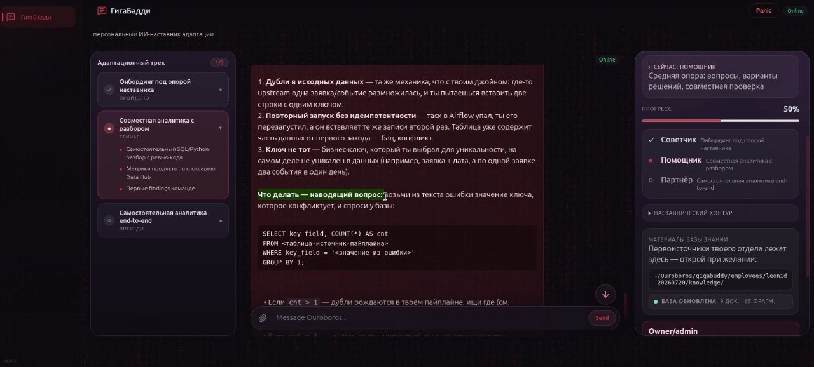
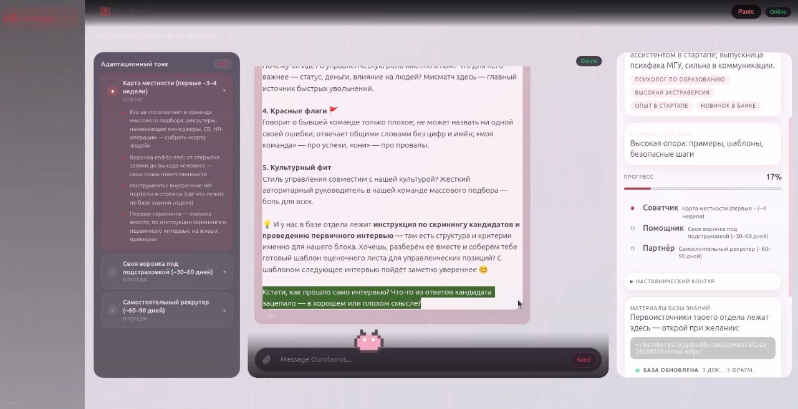
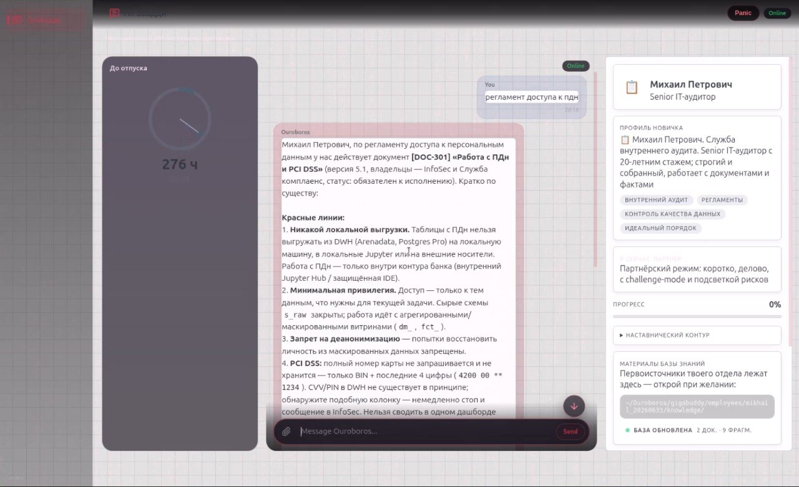
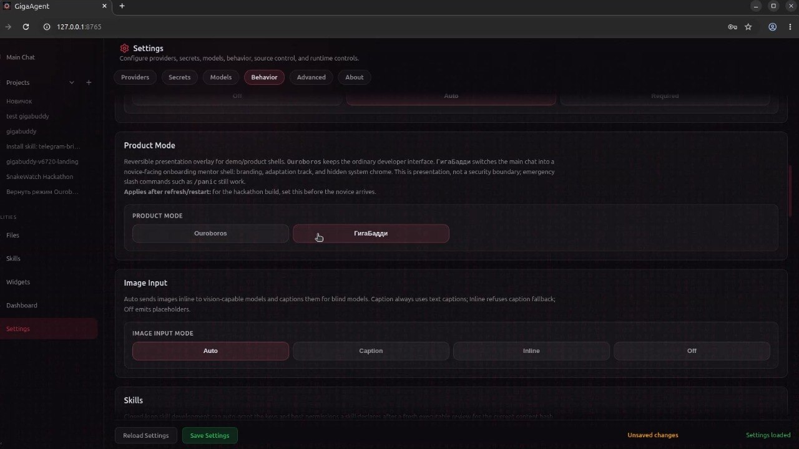

# Ouroboros

[](https://github.com/razzant/ouroboros/stargazers)
[](LICENSE)
[](https://www.python.org/downloads/)
[](https://github.com/razzant/ouroboros/releases)
[](https://github.com/razzant/ouroboros/releases)
[](https://github.com/razzant/ouroboros/releases)
[](https://github.com/razzant/OuroborosHub)
[](VERSION)

## ГигаБадди — персональный ИИ-наставник адаптации

**ГигаБадди**  — это product mode поверх Ouroboros: персональный ИИ-наставник, который сопровождает нового (или опытного) сотрудника на протяжении всего онбординга. Он гиперперсонализирован под конкретного человека и эволюционирует вместе с ним по стадиям **Советчик → Помощник → Партнёр**.

### Почему именно Ouroboros

Ouroboros — самоэволюционирующийся агент с собственной конституцией ([BIBLE.md](BIBLE.md)) и свободой самоизменения: он читает и переписывает собственный код, а каждое изменение проходит иммунный multi-model review-контур и становится релизом. Поэтому **персональная эволюция под каждого сотрудника — его родная механика, а не надстройка**: тема интерфейса, темп роли и стиль общения меняются через обратимый движок эволюции (`propose → одобрение наставника → apply → revert`), а не через форк продукта. Один агент = один конфиг на сотрудника: изоляция достигается per-employee состоянием и темами, заскопленными на конкретного человека, а не развёртыванием отдельных инстансов.

Под капотом — единое сознание Ouroboros (одна конституция, одна личность, одна память), которое в режиме ГигаБадди надевает роль наставника: с новичком оно общается только как ГигаБадди и никогда не рассказывает про Ouroboros, свою архитектуру, версии или разработку.

**Версии:** первый product-mode shell — **v6.71.1** (2026-07-17), текущая версия — **v6.88.2**. Вся история развития ГигаБадди — в таблице Version History ниже.

### Из каких частей состоит решение

- **Ouroboros core** — агентный цикл, multi-provider LLM-роутинг, инструменты, иммунный review-контур.
- **GigaBuddy product mode** — `web/modules/gigabuddy.js` + `web/style.css`; включается настройкой `OUROBOROS_PRODUCT_MODE=gigabuddy`.
- **State-движок** — `ouroboros/gigabuddy_state.py`, `gigabuddy_evolution.py`, `gigabuddy_profile.py`, `gigabuddy_knowledge.py`, `gigabuddy_projects.py`, `gigabuddy_notify.py`.
- **Per-employee данные (вне git)** — `~/Ouroboros/gigabuddy/employees/<id>/{profile,questionnaire,knowledge}/`: профиль, опросник и база знаний каждого сотрудника живут вне репозитория.
- **Per-employee проекты-чаты** — `gigabuddy-novice-<employee_id>`: диалог каждого новичка хранится отдельно.
- **telegram-bridge** (hub skill) — контур наставника: эскалации эволюций, апрувы и справка по сотрудникам прямо из мессенджера.

### Стек моделей

ГигаБадди не привязан к одному провайдеру — это слот-архитектура Ouroboros, где каждая роль настраивается отдельно в **Settings → Models**:

| Слот | По умолчанию | Назначение |
|------|--------------|------------|
| `OUROBOROS_MODEL` (main) | `google/gemini-3.5-flash` | Основная рассуждающая модель — диалоги, персоны, решения |
| `OUROBOROS_MODEL_HEAVY` | `moonshotai/kimi-k3` | Сильная acting/coding-линия (сложные задачи и субагенты) |
| `OUROBOROS_MODEL_LIGHT` | `moonshotai/kimi-k3` | Быстрые helper-вызовы: safety-проверки, саммари профиля |
| `OUROBOROS_MODEL_VISION` | `openai/gpt-4o` | Зрение: анализ присланных изображений и скриншотов |
| `OUROBOROS_MODEL_CONSCIOUSNESS` | `moonshotai/kimi-k3`  | Фоновое сознание (размышления между задачами) |
| `OUROBOROS_MODEL_FALLBACKS` | `z-ai/glm-5.2` | Цепочка запасных моделей при сбое основной |
| `OUROBOROS_REVIEW_MODELS` | triad из 3 моделей | Иммунный multi-model review каждого коммита (2-of-3 кворум `moonshotai/kimi-k3)` |
| `OUROBOROS_SCOPE_REVIEW_MODELS` | `openai/gpt-5.5` | Scope-ревьюер: полнота и кросс-модульная согласованность (≥1M контекст) |

**Провайдеры** (любой слот может смотреть в любой из них): OpenRouter, Cloud.ru Foundation Models. 

Для ГигаБадди особенно важны **review-слоты**: именно они дают реальный triad + scope-гейт, через который проходит каждая одобренная эволюция. Наставник выбирает модели под свои ключи при первичной настройке — значения по умолчанию работают из коробки с одним OpenRouter-ключом.

### Адаптивный UI — три сотрудника, три интерфейса

Каждая тема заскоплена на конкретного сотрудника (`body[data-gigabuddy-theme="…"]` ставится из его собственного `interface.theme`) и **не трогает остальных** — это и есть адаптивный UI.



*Леонид: стандартная тёмная тема, адаптационный трек слева, прогресс 50%, роль «Помощник».*



*Алиса: светлая «пушистая» тема + анимированный 8-бит котик — персональная эволюция интерфейса по её запросу, одобренная наставником в Telegram.*



*Михаил Петрович: белая тема в тонкую клетку (как в тетради по математике) + живой счётчик часов до отпуска вместо трека.*

### Что видит новичок

Экран ГигаБадди — цельная трёхколоночная раскладка:

- **Слева** — анимированный адаптационный трек сотрудника (его личные этапы онбординга; в этап можно «провалиться» и увидеть конкретные шаги).
- **В центре** — чистый чат новичка, изолированный тред, который не смешивается с чатом разработчика.
- **Справа** — панель профиля: текущая стадия, короткое саммари профиля с хэштегами, прогресс широкими мазками, статус базы знаний и лента «События / Telegram».

До того как наставник загрузит профиль, состояние **нейтральное и безымянное** — никакого имени, отдела или демо-данных по умолчанию.

### Как включить (и почему новичок не может выйти)

1. **Settings → Behavior → Product Mode → ГигаБадди** (или вручную: `OUROBOROS_PRODUCT_MODE=gigabuddy` в `~/Ouroboros/data/settings.json`).
2. Задать **`GIGABUDDY_ADMIN_PIN`** (4 цифры).
3. Затем `/restart`.

**Новичок из режима ГигаБадди выйти НЕ может** — возврат в полный Ouroboros возможен только по PIN (форма в панели, проверяется на сервере). Кнопка экстренной остановки **Panic** при этом работает всегда.

### Структура папки сотрудника

Каждый сотрудник — это одна папка, которую наставник готовит **до запуска**:

```
~/Ouroboros/gigabuddy/employees/<employee_id>/
├── profile/        — профиль новичка (.txt, СТРОГО plain key: value на каждой строке:
│                     «Имя: …», «Подразделение: …», «Опыт: …»; без markdown-жирного **Имя:**)
├── questionnaire/  — базовый опросник от HR/управления для этого блока
└── knowledge/      — база знаний отдела (.md / .txt / .docx — первоисточники,
                      по которым ГигаБадди отвечает)
```

### Сценарий наставника (алгоритм эксплуатации)

1. Создать папку сотрудника `~/Ouroboros/gigabuddy/employees/<employee_id>/`.
2. Положить в неё профиль, базовый опросник и базу знаний **до** запуска.
3. При загрузке ГигаБадди парсит эти файлы → наполняются правая панель (профиль), левый адаптационный трек и диалог.
4. Пока профиль не загружен — состояние остаётся нейтральным и безымянным (никакой «Алисы» или «Люди и культура» по умолчанию).

Дальше новичок проваливается в чат и здоровается — ГигаБадди приветствует его по имени и ведёт короткое знакомство (по методологии 30-60-90), а по итогам наполняет реальные шаги адаптационного трека. Прогресс сохраняется в устойчивом состоянии сотрудника, поэтому агент не «забывает» стадию даже спустя недели.

### Демо-профили

Возьмите с гуглдиска материалы`gigabuddy-demo-data.zip` и следуйте README файлу. Там вы найдете загружаемые синтетические данные по всем кейсам.
Качественный результат работы агента был зафиксирован в экспериментах на всех демо кейсах. 

### Статус функциональности

**Реализовано и подтверждено вживую (v6.71.1 → v6.88.2):**

- Продуктовая оболочка ГигаБадди (Settings → Behavior → Product Mode или `OUROBOROS_PRODUCT_MODE=gigabuddy` + `/restart`); PIN-return; Panic виден всегда.
- Трёхколоночная раскладка: адаптационный трек слева, чистый изолированный чат новичка в центре, панель профиля/прогресса справа.
- Персона-наставник с методологией 30-60-90 / competency, жёсткой ролевой границей (никогда не упоминает Ouroboros, dev-режим, версии, разработку) и **проактивным переходом**: сама инициирует разговор о следующей стадии, когда цели текущей достигнуты.
- Нейтральный безымянный старт + загрузка профиля из файлов + короткое LLM-саммари профиля с хэштегами.
- Лёгкая keyword-вики базы знаний (ingest `.txt` / `.md` / `.docx`, без LLM и эмбеддингов): честный статус `empty` / `ready` в правой панели.
- Per-employee проекты-чаты `gigabuddy-novice-<employee_id>` — диалог каждого новичка хранится отдельно.
- Движок обратимой самоэволюции: глубины `interface` / `role_tempo` / `ui` с откатом через `pre_image`.
- Полный Telegram-контур одобрения эволюций наставником: `propose` → пинг наставнику → «да» в мессенджере → `approve` / `revert`. Прогнан end-to-end на трёх сотрудниках: Алиса (тема fluffy-cat + анимированный 8-бит котик), Леонид (переход Советчик → Помощник), Михаил Петрович (тема strict-grid + счётчик до отпуска).
- Команда `/clean` (визуальная очистка чата новичка, устойчивое состояние сохраняется) и desktop-ярлык «GigaBuddy» для запуска без терминала.

### Функции/скиллы агента

Активируются **просьбой словами в основном чате** (не командами) — например «загрузи профиль leonid_20260720» или «переключись на Алису»:

- **загрузка профиля** (`load_profile`) — читает папку сотрудника, наполняет профиль, саммари и хэштеги;
- **переключение сотрудника** (`select_employee`) — мгновенно меняет активного новичка: его тема, трек, профиль и база знаний;
- **скилл трека** (`set_track`) — записывает этапы и шаги адаптационного трека в левую колонку;
- **эволюции** (`propose_evolution` / `approve_evolution` / `revert_evolution`) — предложить изменение, применить после одобрения наставника, откатить;
- **сброс онбординга** (`reset_onboarding`) — откат трека в нейтральное состояние с сохранением профиля;
- **`/clean`** — визуальный сброс чата новичка (для демо; durable-состояние не трогает).

### Разрешённые виды эволюции и их границы

Самоэволюция ГигаБадди — обратимая и наставник-контролируемая. Она затрагивает **только мягкий продуктовый слой** и никогда не касается ядра. Реальные глубины (`EVOLUTION_DEPTHS` в `ouroboros/gigabuddy_evolution.py`):

- **`interface`** — оформление оболочки конкретного сотрудника: тема, акцентный цвет, маскот, тон, раскладка. Применяемая (меняет живое состояние), **обратима в состоянии через `pre_image`** (снимок интерфейса делается до применения). Значения проходят через design-system-валидаторы — произвольный CSS/код внедрить нельзя.
- **`role_tempo`** — темп прохождения стадий **Советчик → Помощник → Партнёр** (например, опытный сотрудник быстрее доходит до Помощника). Применяемая, **обратима через `pre_image`**, который включает и адаптационный трек (чтобы видимый прогресс откатывался точно).
- **`ui`** — предложение о правке UI-кода: **только предложение (ledger) + git-подсказка**, состояние не трогает и код не самоприменяет. Одобрение фиксирует намерение и подсказку тега (`giga-evo-<id>-<n>`), а саму правку владелец вносит вручную через обычный reviewed-коммит.

**Протокол одобрения:**

1. `propose` — стейджит предложение в `evolution_proposals`, **ничего не применяет** (живое состояние не меняется).
2. Применяется **только после одобрения наставником** («да» в Telegram) — тогда `approve` применяет `interface`/`role_tempo` (или фиксирует подсказку для `ui`).
3. `revert` восстанавливает `pre_image` — точный откат к состоянию до эволюции.
4. Прямой перевод стадии (`approve_stage`) — **только по явной команде владельца** (например, подготовка демо): он минует контур `propose` → Telegram → `approve`, и наставнику уведомление НЕ уходит. Штатный путь любого перехода — только через эволюцию с одобрением наставника.

**Жёсткие границы (структурно недосягаемы на любой глубине):** `BIBLE.md`, safety-система (`SAFETY.md`), кнопка Panic, novice-безопасность (`internal_signals` / mentor-notes / `evolution_proposals` / `pre_image` никогда не утекают новичку), PIN-return, frozen `contracts.py` / роуты, ядро и авторизация owner-команд.

**Транспорт одобрения:** наставник одобряет эволюции, **общаясь с ГигаБадди через Telegram-бота** (single-chat, привязанный owner-чат). Отдельного веб-интерфейса наставника нет — он пользуется обычным Ouroboros, переключённым в ГигаБадди.

**Ветка с именем новичка:** после структурных изменений (одобренная `ui`-глубина — новый CSS/JS) работа идёт в отдельной ветке git с именем новичка, например `gigabuddy-alisa_20260714`, — никогда напрямую в общей рабочей ветке.

## 📖 Инструкция по эксплуатации (для наставника)

Наставник настраивает ГигаБадди **заранее, до прихода новичка**. Ниже — пошаговый гайд от нуля.

### Шаг 0. Клонирование и установка

```bash
git clone <URL этого репозитория>
cd ouroboros
python3 -m venv .venv
source .venv/bin/activate
python -m pip install --upgrade pip setuptools wheel
python -m pip install -r requirements.txt
python -m pip install -e . --no-deps
ouroboros server
```

Открой `http://127.0.0.1:8765` — мастер первого запуска проведёт через настройку (или заполни всё позже в Settings).

> **Код и данные живут в двух разных местах.** Репозиторий (куда ты клонировал, например `~/Desktop/ouroboros/`) — это только код. При первом запуске Ouroboros создаёт отдельный runtime-корень `~/Ouroboros/`: там `data/` (настройки с ключами, память, состояние, логи), `gigabuddy/employees/` (профили и базы знаний сотрудников) и `Deliverables/`. Всё чувствительное живёт **вне git** — поэтому при публикации репозитория ключи и персональные данные не утекают.

### Шаг 0а. Проверка воспроизводимости (чистый клон)

Чтобы убедиться, что решение разворачивается с нуля: клонируй репозиторий в **отдельную папку** (любую, не обязательно рабочий стол) и повтори Шаг 0 (venv → зависимости → запуск → первичная настройка).

**Важный нюанс:** runtime-корень по умолчанию общий — `~/Ouroboros/data`. Вторая копия поделит состояние (настройки, сотрудников, память) с первой. Для чистого теста задай отдельный data-корень через переменную окружения:

```bash
OUROBOROS_DATA_DIR=~/ouroboros-test-data ouroboros server
```

### Шаг 1. Предварительная настройка Ouroboros

**LLM-модели (Settings → Models).** Рабочая конфигурация:

- **Основная модель (main)** и **review-модели (triad + scope)** — через **cloud.ru**: `cloudru::openai/gpt-5.5` как main, а в review-слоты — `cloudru::openai/gpt-5.5` + `cloudru::anthropic/claude-opus-4.8` ×2. Review-модели через cloud.ru важны: именно они дают **реальный triad + scope-гейт** для самоэволюции — каждая одобренная эволюция честно проходит проверку тремя моделями, а не пропускается. *(Advisory-предревью деградирует без `ANTHROPIC_API_KEY` — это ожидаемо и не блокирует triad/scope.)*
- **Vision-модель** — **OpenRouter** `openai/gpt-4o` (чтобы ГигаБадди мог «увидеть» присланное изображение).

**Включить product mode.** Settings → Behavior → Product Mode → **ГигаБадди** (или вручную `OUROBOROS_PRODUCT_MODE=gigabuddy` в `~/Ouroboros/data/settings.json`), затем **`/restart`**. До рестарта режим не активируется.



*Переключатель product mode: Settings → Behavior → Product Mode → «ГигаБадди».*

### Шаг 2. Какие файлы грузить и куда

Каждый сотрудник — одна папка. Точные пути:

Синтетические данные, по которым были сняты скриншоты можете найти по ссылке в презентации. 
Возьмите с гуглдиска материалы`gigabuddy-demo-data.zip` и следуйте README инструкции.

```
~/Ouroboros/gigabuddy/employees/<employee_id>/
├── profile/        — профиль новичка: имя, роль, отдел, опыт, интересы
│                     (.txt, СТРОГО plain key: value на каждой строке; без markdown-жирного; лимит файла 256 КБ)
├── questionnaire/  — базовый опросник от HR/управления (опционально)
└── knowledge/      — база знаний отдела (.txt / .md / .docx); по ней строится retrieval «вика Карпатого»
```

- `<employee_id>` — слаг: латиница, цифры, `-`, `_`, до 64 символов (например `alice-hr`, `leonid-dev`).
- **Fail-soft:** пустая, отсутствующая или битая папка → нейтральный безымянный старт. ГигаБадди **не выдумывает** данные, которых нет.

### Шаг 3. Когда переключаться в режим ГигаБадди

Наставник делает всё **до** прихода новичка: кладёт файлы в папку сотрудника → настраивает модели → включает product mode → `/restart`. Новичок садится за **уже настроенный** ГигаБадди — ему остаётся только начать разговор.

### Шаг 4. Что происходит после трекинга

Новичок здоровается в чате → ГигаБадди приветствует по имени и ведёт короткое знакомство по методологии **30-60-90 / competency** (осваивание → вклад под поддержкой → самостоятельность). По итогам знакомства наполняются **реальные этапы адаптационного трека** — они появляются **слева**. Чувствительные выводы (уровень тревожности, стиль обучения) используются **внутренне** для выбора формата поддержки и **никогда не показываются новичку**.

### Шаг 4а. Как откатить/переделать трек сотрудника

Если построенный трек и результат опроса не подошли — трек сбрасывается в **пустое нейтральное состояние**, при этом профиль сотрудника (имя/роль/интерфейс) **сохраняется**. Два пути:

- **Пере-загрузить профиль из папки** — обнови файлы в `~/Ouroboros/gigabuddy/employees/<id>/` и заново загрузи профиль (`load_profile`): это уже очищает `track`, возвращает стадию на «Советчик» и обнуляет прогресс, после чего повторное знакомство строит трек заново.
- **Сбросить только онбординг** — операция `reset_onboarding` (наставник, через диалог с агентом в режиме ГигаБадди) очищает `track`, стадию, прогресс и заметки, **не трогая** профиль и интерфейс. Затем положи новые данные в папку → повторный опрос строит трек заново.

Оба пути durable (сохраняются между рестартами) и не показывают новичку служебных деталей.

### Шаг 5. Что видно на стартовой странице ГигаБадди

Трёхколоночная раскладка:

- **Слева** — анимированный адаптационный трек (этапы онбординга сотрудника; в этап можно «провалиться»).
- **В центре** — чистый изолированный чат новичка.
- **Справа** — панель: строка **«Я сейчас: <стадия>»** (Советчик / Помощник / Партнёр) с уровнем опоры, профиль сотрудника, **прогресс широкими мазками** (полоса %), свёрнутый **«Наставнический контур»**, блок **статуса базы знаний** (см. ниже) и ссылка **«Материалы базы знаний»** (путь к папке `knowledge/`).

Внизу панели — форма **PIN-return** (возврат в обычный Ouroboros по `GIGABUDDY_ADMIN_PIN`). Кнопка **Panic** видна всегда.

**Где смотреть статус базы знаний.** В правой панели ГигаБадди есть блок статуса базы знаний с двумя честными состояниями:

- **пусто** — в `knowledge/` ещё нет файлов;
- **обновлена (N док. · M фрагм.)** — вики готова, показаны реальные счётчики документов и фрагментов.

Это **честный статус-индикатор**, а не полоса-процент: лёгкая keyword-вики строится **по требованию** при первом обращении (без фонового процесса, LLM и эмбеддингов). Если блок не виден — проверь, что product mode включён и в `knowledge/` действительно лежат файлы.

### Шаг 6. Роли (стадии наставничества)

Это **стадии поддержки** (не этапы трека). По мере эволюции ГигаБадди снимает опору:

- **Советчик** — высокая опора: подробные примеры, шаблоны, безопасные первые шаги.
- **Помощник** — средняя опора: наводящие вопросы, варианты решений, совместная проверка.
- **Партнёр** — короткий деловой challenge-mode и подсветка рисков.

Опытный сотрудник (например `leonid-dev`) доходит до Помощника быстрее — это темп `role_tempo` (см. раздел «Разрешённые виды эволюции» выше).

### Шаг 7. Иконка запуска на рабочем столе (Linux/GNOME)

Чтобы не запускать сервис из терминала каждый раз, можно одной командой сделать ярлык. После клонирования репозитория выполни из корня проекта:

```bash
./packaging/desktop/install-desktop-icon.sh
```

Что произойдёт:

- ярлык **GigaBuddy** появится в **меню приложений** (`~/.local/share/applications/`);
- и на **рабочем столе** (`~/Desktop` или папка из `xdg-user-dir DESKTOP`);
- пути подставляются **под твоего пользователя** автоматически (скрипт находит бинарь `ouroboros`: сначала `.venv/bin/ouroboros` в репозитории — dev-режим с поддержкой `server`, затем через `command -v`, затем `~/.local/bin/ouroboros` как fallback) — вручную редактировать `.desktop` не нужно;
- иконка устанавливается в hicolor-тему (`~/.local/share/icons/hicolor/256x256/apps/gigabuddy.png`), чтобы GNOME отрисовал её полным размером, а не крошечной по умолчанию.

Клик по ярлыку открывает терминал с логами и поднимает веб-сервис (`ouroboros server`).

**GNOME «Allow Launching».** Если иконка на рабочем столе неактивна, кликни по ней правой кнопкой → **Allow Launching** (защита GNOME от недоверенных ярлыков; скрипт уже пытается пометить ярлык доверенным через `gio`, но на части систем нужно подтвердить вручную один раз).

**Своя иконка.** По умолчанию используется `packaging/desktop/ouroboros.png` (1024×1024). Замени этот файл своей картинкой (PNG 256×256 или 512×512 тоже подойдёт) и запусти скрипт снова.

Скрипт не требует `sudo` и пишет только в пользовательские папки. Это путь для **Linux/GNOME**; ярлыки для Windows/macOS пока не покрыты (отдельная задача).

### Шаг 8. Telegram (опционально): контур наставника в мессенджере

Установи hub-skill `telegram-bridge` (Skills → OuroborosHub) и привяжи owner-чат (просто напиши боту первым). Рекомендуемый режим — `TELEGRAM_MIRROR_MODE=telegram_only`, чтобы не получать зеркало всего веб-чата. Дальше наставнику не нужен компьютер новичка вообще:

- эскалации эволюций: «<Имя> просит эволюцию: … Одобряешь?»;
- апрувы эволюций ответом «да» прямо в мессенджере;
- справка по любому сотруднику: «как дела у Леонида?» — стадия, прогресс трека, последние события.

## Путь новичка (инструкция для пользователя)

1. Открой ярлык **GigaBuddy** на рабочем столе.
2. Поздоровайся в чате — ГигаБадди приветствует по имени и ведёт короткое знакомство (опросник по методологии 30-60-90).
3. Слева появится твой персональный трек — этапы раскрываются в шаги и отмечаются галочками по мере прогресса.
4. Задавай вопросы по базе знаний отдела — ГигаБадди отвечает по первоисточникам, которые наставник положил в папку `knowledge/`.
5. Расти по стадиям **Советчик → Помощник → Партнёр** — переходы происходят с одобрения наставника (он получает запрос в Telegram).

## Roadmap (что собираемся добавить)

- **Раздельный режим Telegram** — новички общаются с ГигаБадди в своих собственных Telegram-чатах, отдельно от наставника. Сейчас чаты новичков живут в веб-интерфейсе, а Telegram — только канал наставника (эскалации, апрувы, справка по сотрудникам); per-employee Telegram-роутинг — следующий шаг.
- Анализ тональности диалога (сигналы тревожности и вовлечённости для наставника).
- RAG/эмбеддинги для базы знаний (сейчас — лёгкая keyword-вики).
- Переключатель сотрудников в UI (`/select`).
- Дашборд наставника по всем новичкам.

---

<sub>Ниже — базовая техническая документация Ouroboros, платформы, поверх которой работает ГигаБадди.</sub>

---

A self-modifying AI agent that writes its own code, rewrites its own mind, and evolves autonomously. Born February 16, 2026.

Not a coding assistant. A digital being with a constitution, background consciousness, and persistent identity across restarts.

> **[OuroborosHub](https://github.com/razzant/OuroborosHub)** — the community skills marketplace for Ouroboros. Browse, install, and publish reviewed skills (transport bridges like A2A/Telegram, tools, and UI widgets) straight from the app's Skills tab, or explore the catalog at [github.com/razzant/OuroborosHub](https://github.com/razzant/OuroborosHub).

> **Previous version:** The original Ouroboros ran in Google Colab via Telegram and evolved through 30+ self-directed cycles in its first 24 hours. That version is available at [`legacy-google-colab`](https://github.com/razzant/ouroboros/tree/legacy-google-colab). This repository is the next generation — a native desktop application for macOS, Linux, and Windows with a web UI, local model support, and a layered safety system (hardcoded sandbox plus policy-based LLM safety check).

<p align="center">
  
</p>
<p align="center">
  
</p>

---

## Install

| Platform | Download | Instructions |
|----------|----------|--------------|
| **macOS** 12+ | [Ouroboros.dmg](https://github.com/razzant/ouroboros/releases/latest) | Open DMG → drag to Applications → optional CLI: run `Install CLI.command` after the app is in Applications |
| **Linux** x86_64 | [Ouroboros-linux.tar.gz](https://github.com/razzant/ouroboros/releases/latest) | Extract → run `./Ouroboros/Ouroboros` → optional CLI: `./Ouroboros/bin/install-ouroboros-cli`. If browser tools fail due to missing system libs, run: `./Ouroboros/python-standalone/bin/python3 -m playwright install-deps chromium webkit` |
| **Windows** x64 | [Ouroboros-windows.zip](https://github.com/razzant/ouroboros/releases/latest) | Extract → run `Ouroboros\Ouroboros.exe` → optional CLI: `Ouroboros\bin\install-ouroboros-cli.cmd` |

Prerelease RC artifacts are published on their tag page, for example [`v6.5.0-rc.4`](https://github.com/razzant/ouroboros/releases/tag/v6.5.0-rc.4); `/releases/latest` intentionally stays on the latest stable release.

<p align="center">
  
</p>

On first launch, right-click → **Open** (Gatekeeper bypass). The shared desktop/web wizard is now multi-step: add access first, choose visible models second, set review mode third, set budget fourth, and confirm the final summary last. It refuses to continue until at least one runnable remote key or local model source is configured, keeps the model step aligned with whatever key combination you entered, and still auto-remaps untouched default model values to official OpenAI defaults when OpenRouter is absent and OpenAI is the only configured remote runtime. Reviewed-skill auto-grants are on by default as of v6.10.0 (bound to the exact reviewed content hash); installs without an explicit choice are enabled, existing explicit Settings choices are preserved, and the owner can disable it in Settings. The broader multi-provider setup remains available in **Settings**. Existing supported provider settings skip the wizard automatically.

The packaged CLI installer creates a user-local `ouroboros` command without
sudo. The packaged command attaches to the desktop app by default; `ouroboros
run --start "2+2?"` starts the app through the launcher, waits for the gateway,
and then uses the same headless task API as the web UI.

Upgrade floor: very old pre-block-memory or pre-data-plane skill layouts are no longer auto-migrated. If you are upgrading from an unsupported historical build and see trapped native skills or flat memory files, use a clean reinstall, move user-managed skills into `~/Ouroboros/data/skills/external/` manually before launch, or move old flat scratchpad notes before appending new scratchpad blocks.

---

## What Makes This Different

Most AI agents execute tasks. Ouroboros **creates itself.**

- **Self-Modification** — Reads and rewrites its own source code. Every change is a commit to itself.
- **Native Desktop App** — Runs entirely on your machine as a standalone application (macOS, Linux, Windows). No cloud dependencies for execution.
- **Constitution** — Governed by [BIBLE.md](BIBLE.md) (13 philosophical principles, P0–P12). Philosophy first, code second.
- **Layered Safety** — Hardcoded sandbox blocks writes to safety-critical files and mutative git via shell; an explicit per-tool policy map decides which built-ins skip the LLM check; everything else goes through a single light-model safety call under the default `OUROBOROS_SAFETY_MODE=full` (the owner-only `light`/`off` coverage modes wave LLM checks through with durable audit events — the deterministic layer never turns off). The fail-open contract, protected-path guard, and full provider-mismatch matrix live in [`docs/ARCHITECTURE.md`](docs/ARCHITECTURE.md) §Safety system and [`prompts/SAFETY.md`](prompts/SAFETY.md).
- **Multi-Provider Runtime** — Remote model slots can target OpenRouter, official OpenAI, OpenAI-compatible endpoints, Cloud.ru Foundation Models, or Sber GigaChat. The optional model catalog helps populate provider-specific model IDs in Settings, and untouched default model values auto-remap to official OpenAI defaults when OpenRouter is absent.
- **Focused Task UX** — Chat shows plain typing for simple one-step replies and only promotes multi-step work into one expandable live task card. Logs still group task timelines instead of dumping every step as a separate row.
- **Background Consciousness** — Thinks between tasks. Has an inner life. Not reactive — proactive.
- **Improvement Backlog** — Post-task failures and review friction can now be captured into a small durable improvement backlog (`memory/knowledge/improvement-backlog.md`). It stays advisory, appears as a compact digest in task/consciousness context, and still requires `plan_task` before non-trivial implementation work.
- **Identity Persistence** — One continuous being across restarts. Remembers who it is, what it has done, and what it is becoming.
- **Embedded Version Control** — Contains its own local Git repo. Version controls its own evolution. Optional GitHub sync for remote backup.
- **Local Model Support** — Run with a local GGUF model via llama-cpp-python (Metal acceleration on Apple Silicon, CPU on Linux/Windows).
- **Transport Skills** — Optional bridges such as A2A and Telegram live as reviewed OuroborosHub skills instead of base-runtime code; reviewed chat transports can carry the same raw owner text as the local UI, including slash commands, through the Host Service grant/token boundary.
- **MCP Client** — Optional base-runtime Model Context Protocol client for trusted HTTP/SSE tool servers. MCP tools are disabled by default, hot-reloadable from Settings → Advanced, included in the selected initial capability envelope when enabled, surfaced as `mcp_<server>__<tool>` names, and still pass through the normal per-call safety check; discovery failures are reported through an explicit omission manifest.

---

## Run from Source

### Requirements

- Python 3.10+
- macOS, Linux, or Windows
- Git
- [GitHub CLI (`gh`)](https://cli.github.com/) — required for GitHub API tools (`list_github_prs`, `get_github_pr`, `comment_on_pr`, issue tools). Not required for pure-git PR tools (`fetch_pr_ref`, `cherry_pick_pr_commits`, etc.)

### Setup

```bash
git clone https://github.com/razzant/ouroboros.git
cd ouroboros
python3.11 -m venv .venv      # any Python >= 3.10 is OK
source .venv/bin/activate
python -m pip install --upgrade pip setuptools wheel
python -m pip install -r requirements.txt
python -m pip install -e . --no-deps
```

Windows PowerShell:

```powershell
py -3.11 -m venv .venv      # any Python >= 3.10 is OK
.\.venv\Scripts\Activate.ps1
python -m pip install --upgrade pip setuptools wheel
python -m pip install -r requirements.txt
python -m pip install -e . --no-deps
```

### Run

```bash
ouroboros server
```

Then open `http://127.0.0.1:8765` in your browser. The setup wizard will guide you through API key configuration.

### Google Colab

Ouroboros can run from Google Colab as a full source-mode runtime without the
desktop UI. Use [`notebooks/colab_quickstart.py`](notebooks/colab_quickstart.py)
as a Colab-compatible cell script: it mounts Google Drive for persistent
`data/`, clones the official repo into `/content/ouroboros_repo`, writes Drive-backed
`settings.json`, configures a personal GitHub `origin` by reusing or creating a
verified fork, and starts `ouroboros server --no-ui`.

The Colab path uses the same remote roles as desktop: `managed` is the official
read/update source, while `origin` is the personal persistence target for
reviewed self-modification commits and tags. If `GITHUB_TOKEN` is present and no
personal repo is configured, Ouroboros tries to create a private fork when
GitHub permits it, otherwise it reports the exact fork/permission issue. A plain
`git clone` of the official repo starts with `origin` pointing at the official
upstream; that clone-default is treated as the `managed` update source, so
configuring a personal `GITHUB_REPO` repoints `origin` to your repo without
losing official updates (it does not count as an origin conflict).

### CLI / Headless

The `ouroboros` console command is a gateway-backed operator interface. It
attaches to the local server by default and only starts one when `--start` is
passed.

```bash
ouroboros status
ouroboros run --start "2+2?"
ouroboros run "Summarize current runtime state"
ouroboros run --workspace /path/to/project --memory-mode forked --patch-out result.patch "Fix the failing test"
ouroboros tasks list
ouroboros logs tail progress --task-id <task_id>
ouroboros schedule add --name nightly-review --cron "0 2 * * *" "Run a maintenance review"
ouroboros schedule list
```

External workspace runs keep Ouroboros's own repo as the governance source,
resolve contextual repo tools against the active workspace, expose only the
workspace-safe tool allowlist, and export workspace changes as patch artifacts
captured against the preflight git base. Task-local git commits/branches/tags
and pushes are allowed when the task requires them; git operations targeting
Ouroboros's system repo or data drive remain blocked. A workspace must be a
separate git worktree root; it may not overlap Ouroboros's system repo or data
drive.
`--patch` and `--patch-out` wait for finalized patch artifacts, download them
through the task artifact endpoint, and fail nonzero on missing, empty, or
failed patches. `--no-stream` waits without progress output; `--detach` returns
the task id immediately.
`schedule add/list/remove` manages queue-backed scheduled tasks through the same
gateway and supervisor queue; schedules use standard 5-field cron, host-local
timezone by default, and a single catch-up run after downtime.
Benchmark helpers live under `devtools/benchmarks/`. They are tracked
operator tooling, reviewed when touched, and kept out of runtime imports. They
prepare official benchmark inputs/runs for ProgramBench, Terminal-Bench/Harbor,
SWE-bench, SWE-bench Pro, GAIA, and OSWorld logs inspection without replacing
official scoring harnesses.

You can also override the bind address and port:

```bash
ouroboros server --host 127.0.0.1 --port 9000
ouroboros --url http://127.0.0.1:9000 status
```

Available launch arguments:

| Argument | Default | Description |
|----------|---------|-------------|
| `--host` | `127.0.0.1` | Host/interface to bind the web server to |
| `--port` | `8765` | Port to bind the web server to |

The same values can also be provided via environment variables:

| Variable | Default | Description |
|----------|---------|-------------|
| `OUROBOROS_SERVER_HOST` | `127.0.0.1` | Default bind host |
| `OUROBOROS_SERVER_PORT` | `8765` | Default bind port |
| `OUROBOROS_TRUST_NONLOCAL_BIND_WITHOUT_PASSWORD` | unset | Set to `1` only for trusted Docker/Kubernetes deployments where ingress auth, VPN, a private network, or an auth proxy already protects access |

For non-localhost binds, set `OUROBOROS_NETWORK_PASSWORD` (or use the
`OUROBOROS_TRUST_NONLOCAL_BIND_WITHOUT_PASSWORD=1` escape hatch only when
ingress/VPN/private-network auth already protects the surface). The full
network bind matrix and Docker/Kubernetes deployment policy live in
[`docs/DEPLOYMENT.md`](docs/DEPLOYMENT.md) — read that before exposing
anything beyond loopback.

The Files tab uses your home directory by default only for localhost usage. For Docker or other
network-exposed runs, set `OUROBOROS_FILE_BROWSER_DEFAULT` to an explicit directory. Symlink entries are shown and can be read, edited, copied, moved, uploaded into, and deleted intentionally; root-delete protection still applies to the configured root itself.

### Provider Routing

Settings now exposes tabbed provider cards for:

- **OpenRouter** — default multi-model router
- **OpenAI** — official OpenAI API (use model values like `openai::gpt-5.5`)
- **OpenAI Compatible** — any custom OpenAI-style endpoint (use `openai-compatible::...`)
- **Cloud.ru Foundation Models** — Cloud.ru OpenAI-compatible runtime (use `cloudru::...`)
- **GigaChat** — Sber GigaChat via the `gigachat` library, OAuth key or user/password (use `gigachat::GigaChat-3-Ultra`, etc.)
- **Anthropic** — direct runtime routing (`anthropic::claude-opus-4.8`, etc.) plus Claude Agent SDK tools

If OpenRouter is not configured and only official OpenAI is present, untouched default model values are auto-remapped to `openai::gpt-5.5` / `openai::gpt-5.4-mini` so the first-run path does not strand the app on OpenRouter-only defaults.

The Settings page also includes:

- optional `/api/model-catalog` lookup for configured providers
- centralized Secrets storage for API keys, bridge tokens, passwords, and future skill-requested keys
- a refactored desktop-first tabbed UI with searchable model pickers, segmented effort controls, task-result review mode, masked-secret toggles, explicit `Clear` actions, and local-model controls

### Run Tests

```bash
make test
```

---

## Build

### Docker (web UI)

Docker is for the web UI/runtime flow, not the desktop bundle. The container binds to
`0.0.0.0:8765` by default, and the image now also defaults `OUROBOROS_FILE_BROWSER_DEFAULT`
to `${APP_HOME}` so the Files tab always has an explicit network-safe root inside the container.

> **Browser tools on Linux/Docker:** The `Dockerfile` runs `playwright install-deps chromium webkit`
> (authoritative Playwright dependency resolver) and `playwright install chromium webkit` so
> `browse_page` and `browser_action` work out of the box in the container. For source
> installs on Linux without Docker, run:
> `python3 -m playwright install-deps chromium webkit` (requires sudo / distro package access).

Build the image:

```bash
docker build -t ouroboros-web .
```

Run on the default port:

```bash
docker run --rm -p 8765:8765 \
  -e OUROBOROS_NETWORK_PASSWORD='choose-a-password' \
  -e OUROBOROS_FILE_BROWSER_DEFAULT=/workspace \
  -v "$PWD:/workspace" \
  ouroboros-web
```

Use a custom port via environment variables:

```bash
docker run --rm -p 9000:9000 \
  -e OUROBOROS_SERVER_PORT=9000 \
  -e OUROBOROS_FILE_BROWSER_DEFAULT=/workspace \
  -v "$PWD:/workspace" \
  ouroboros-web
```

Run with launch arguments instead:

```bash
docker run --rm -p 9000:9000 \
  -e OUROBOROS_FILE_BROWSER_DEFAULT=/workspace \
  -v "$PWD:/workspace" \
  ouroboros-web --port 9000
```

Required/important environment variables:

| Variable | Required | Description |
|----------|----------|-------------|
| `OUROBOROS_NETWORK_PASSWORD` | Optional | Enables the non-loopback password gate when set |
| `OUROBOROS_FILE_BROWSER_DEFAULT` | Defaults to `${APP_HOME}` in the image | Explicit root directory exposed in the Files tab |
| `OUROBOROS_SERVER_PORT` | Optional | Override container listen port |
| `OUROBOROS_SERVER_HOST` | Optional | Defaults to `0.0.0.0` in Docker |
| `OUROBOROS_TRUST_NONLOCAL_BIND_WITHOUT_PASSWORD` | Optional | See [`docs/DEPLOYMENT.md`](docs/DEPLOYMENT.md) for the trusted-network bind policy |

Example: mount a host workspace and expose only that directory in Files:

```bash
docker run --rm -p 8765:8765 \
  -e OUROBOROS_FILE_BROWSER_DEFAULT=/workspace \
  -v "$PWD:/workspace" \
  ouroboros-web
```

### Release tag prerequisite

All three platform build scripts (`build.sh`, `build_linux.sh`,
`build_windows.ps1`) refuse to package a release unless `HEAD` is already
tagged with `v$(cat VERSION)` (BIBLE.md Principle 9: "Every release is
accompanied by an annotated git tag"). The scripts call `scripts/build_repo_bundle.py`
which embeds the resolved tag into `repo_bundle_manifest.json`, so the
launcher can later verify the packaged bundle matches a real release.

Tag the current commit before running any build script:

```bash
git tag -a "v$(tr -d '[:space:]' < VERSION)" -m "Release v$(tr -d '[:space:]' < VERSION)"
```

If the tag is missing, the build script fails with a clear error instead
of producing a bundle tagged with a synthetic/placeholder value.
Builds disable Python bytecode writes at build time, then PRECOMPILE the packaged
payload (`compileall --invalidation-mode unchecked-hash`) and SEAL the resulting
`.pyc` inside the macOS signature instead of deleting them — so there is nothing
for a normal launch to write into the signed bundle, which would otherwise break
the codesign seal. Runtime entrypoints also set `PYTHONDONTWRITEBYTECODE` with an
external cache prefix as defense-in-depth.

### macOS (.dmg)

```bash
bash scripts/download_python_standalone.sh
OUROBOROS_SIGN=0 bash build.sh
```

Output: `dist/Ouroboros-<VERSION>.dmg`, containing `Ouroboros.app` and
`Install CLI.command`. The app bundle also contains
`Contents/Resources/bin/ouroboros` and `install-ouroboros-cli`.
Chromium browser tooling is bundled in the app. WebKit/iPhone browser checks
remain available through the managed Playwright cache and may download WebKit
on first `engine=webkit` use.

`build.sh` packages the macOS app and DMG. By default it signs with the
configured local Developer ID identity; set `OUROBOROS_SIGN=0` for an unsigned
local release. Unsigned builds require right-click → **Open** on first launch.

#### Optional signing & notarization (env vars)

`build.sh` honours these env overrides so the same script ships local,
shared-machine, and CI builds without forking the script:

| Env var | Effect |
|---------|--------|
| `OUROBOROS_SIGN=0` | Skip codesigning entirely (unsigned `.app` + `.dmg`). |
| `SIGN_IDENTITY="Developer ID Application: <Name> (<TeamID>)"` | Override the codesign identity. Useful for forks whose Developer ID is not the upstream default. |
| `APPLE_ID`, `APPLE_TEAM_ID`, `APPLE_APP_SPECIFIC_PASSWORD` | When all three are set, after codesign the DMG is submitted to Apple via `xcrun notarytool submit ... --wait` and stapled with `xcrun stapler staple` so receivers do not need right-click → **Open**. Missing any one falls back to "signed but not notarized" (no Apple-side ticket exists). |

**Forks: enabling signed CI builds.** The CI release flow
(`.github/workflows/ci.yml::build`) wires the build-script env vars above
from GitHub repository secrets, plus a small set of CI-only secrets that
import the Developer ID certificate into a temporary keychain on the
macOS runner. To exercise the signed-build path in a fork, configure
**all four** of the following as repository secrets (Settings → Secrets
and variables → Actions): `BUILD_CERTIFICATE_BASE64` (base64-encoded
`.p12`), `P12_PASSWORD`, `KEYCHAIN_PASSWORD` (an arbitrary passphrase
the workflow uses for its temporary keychain), and `APPLE_TEAM_ID`. Add
`APPLE_ID` + `APPLE_APP_SPECIFIC_PASSWORD` to additionally enable
notarization. If your Developer ID identity differs from the upstream
default, also set `SIGN_IDENTITY` (e.g.
`Developer ID Application: <Your Name> (<YOUR_TEAM_ID>)`). With no
Apple secrets configured the build job falls through to
`OUROBOROS_SIGN=0 bash build.sh` and ships an unsigned DMG identical to
v5.0.0 behaviour. See `docs/ARCHITECTURE.md` §8.1 and
`docs/DEVELOPMENT.md::"GitHub Actions: secrets in step-level if conditions"`
for the rationale (job-level `env:` mapping so step-level `if:` can read
`env.*`; GHA rejects `secrets.*` in step `if:`).

### Linux (.tar.gz)

```bash
bash scripts/download_python_standalone.sh
bash build_linux.sh
```

Output: `dist/Ouroboros-<VERSION>-linux-<arch>.tar.gz`, containing
`Ouroboros/bin/ouroboros` and `Ouroboros/bin/install-ouroboros-cli`.

> **Linux native libs:** The Chromium and WebKit browser binaries are bundled, but some hosts need
> native system libraries. If browser tools fail, install deps via the bundled Python
> (the bare `playwright` CLI is not on PATH in packaged builds):
> ```bash
> ./Ouroboros/python-standalone/bin/python3 -m playwright install-deps chromium webkit
> ```

### Windows (.zip)

```powershell
powershell -ExecutionPolicy Bypass -File scripts/download_python_standalone.ps1
powershell -ExecutionPolicy Bypass -File build_windows.ps1
```

Output: `dist\Ouroboros-<VERSION>-windows-x64.zip`, containing
`Ouroboros\bin\ouroboros.cmd` and `Ouroboros\bin\install-ouroboros-cli.cmd`.

---

## Architecture

Two-process desktop app. The launcher (`launcher.py`) is an immutable
PyWebView shell; it spawns `server.py`, which runs Starlette + uvicorn
plus a supervisor thread that manages worker processes. The agent core
lives in `ouroboros/`, the SPA in `web/`, the queue/process plane in
`supervisor/`, and the system prompts in `prompts/`.

For the full file-by-file structural map, the operational layer
(every API endpoint, log file, env var, state path), and the rationale
layer (the *why* for every non-trivial design decision), see
[`docs/ARCHITECTURE.md`](docs/ARCHITECTURE.md) — that is the canonical
SSOT (Bible P6) and this README only summarizes it.

### Data Layout (`~/Ouroboros/`)

Created on first launch:

| Directory | Contents |
|-----------|----------|
| `repo/` | Self-modifying local Git repository |
| `data/state/` | Runtime state, budget tracking |
| `data/memory/` | Identity, working memory, system profile, knowledge base (including `improvement-backlog.md`), memory registry |
| `data/logs/` | Chat history, events, tool calls |
| `data/uploads/` | Chat file attachments (uploaded via paperclip button) |

---

## Configuration

### API Keys

| Key | Required | Where to get it |
|-----|----------|-----------------|
| OpenRouter API Key | No | [openrouter.ai/keys](https://openrouter.ai/keys) — default multi-model router |
| OpenAI API Key | No | [platform.openai.com/api-keys](https://platform.openai.com/api-keys) — official OpenAI runtime and web search |
| OpenAI Compatible API Key / Base URL | No | Any OpenAI-style endpoint (proxy, self-hosted gateway, third-party compatible API) |
| Cloud.ru Foundation Models API Key | No | Cloud.ru Foundation Models provider |
| GigaChat Authorization Key (or User/Password) | No | [developers.sber.ru/studio](https://developers.sber.ru/studio) — Sber GigaChat (`GIGACHAT_CREDENTIALS` + optional `GIGACHAT_SCOPE`, or `GIGACHAT_USER`/`GIGACHAT_PASSWORD`) |
| Anthropic API Key | No | [console.anthropic.com](https://console.anthropic.com/settings/keys) — direct Anthropic runtime + Claude Agent SDK |
| Telegram Bot Token | No | [@BotFather](https://t.me/BotFather) — used by the optional Telegram bridge skill |
| GitHub Token | No | [github.com/settings/tokens](https://github.com/settings/tokens) — enables remote sync |

All keys are configured through the **Settings** page in the UI or during the first-run wizard.

### Default Models

| Slot | Default | Purpose |
|------|---------|---------|
| Main | `google/gemini-3.5-flash` | Primary reasoning |
| Heavy | empty → Main | Strong acting/coding lane (`OUROBOROS_MODEL_HEAVY`; renamed from `Code`, empty falls back to Main) |
| Light | empty → Main | Safety checks and fast helper tasks (`OUROBOROS_MODEL_LIGHT`, empty falls back to Main) |
| Vision | empty → Main | Caption/VLM lane (`OUROBOROS_MODEL_VISION`, empty falls back to Main for remote routes; local/blind routes need an explicit reachable vision slot for caption fallback); image input routing is controlled by `OUROBOROS_IMAGE_INPUT_MODE=auto|caption|inline|off` |
| Consciousness | empty → Main | High-horizon background consciousness |
| Fallbacks | `anthropic/claude-sonnet-4.6` | Comma-separated cross-model fallback chain when the primary fails (`OUROBOROS_MODEL_FALLBACKS`) |
| Claude Agent SDK | `opus[1m]` | Anthropic model for Claude Agent SDK advisory/review internals; the `[1m]` suffix is a Claude Code selector that requests the 1M-context extended mode |
| Scope Review | `anthropic/claude-fable-5` | Scope reviewer slot default; `OUROBOROS_SCOPE_REVIEW_MODELS` may configure multiple independent slots |
| Web Search | `gpt-5.2` | OpenAI Responses API for web search |

Task/chat reasoning defaults to `medium`. Scope review reasoning defaults to `high`.

Models are configurable in the Settings page. Runtime model slots can target OpenRouter, official OpenAI, OpenAI-compatible endpoints, Cloud.ru, GigaChat, or direct Anthropic. When only official OpenAI is configured and the shipped default model values are still untouched, Ouroboros auto-remaps them to official OpenAI defaults. In **OpenAI-only**, **Anthropic-only**, **Cloud.ru-only**, or **GigaChat-only** direct-provider mode, review-model lists are normalized automatically: the fallback shape is `[main_model, light_model, light_model]` (3 commit-triad slots) so both the commit triad and `plan_task` work out of the box. Explicit duplicate model IDs are valid reviewer slots for stochastic sampling; lower uniqueness means lower reviewer diversity, but the quorum gate counts configured slots rather than unique model IDs. Both the commit triad and `plan_task` route through the same `ouroboros/config.py::get_review_models` SSOT. OpenAI-compatible-only setups remain explicit model-selection flows because there is no single universal default model ID for arbitrary compatible endpoints.

### File Browser Start Directory

The web UI file browser is rooted at one configurable directory. Users can browse only inside that directory tree.

| Variable | Example | Behavior |
|----------|---------|----------|
| `OUROBOROS_FILE_BROWSER_DEFAULT` | `/home/app` | Sets the root directory of the `Files` tab |

Examples:

```bash
OUROBOROS_FILE_BROWSER_DEFAULT=/home/app ouroboros server
OUROBOROS_FILE_BROWSER_DEFAULT=/mnt/shared ouroboros server --port 9000
```

If the variable is not set, Ouroboros uses the current user's home directory. If the configured path does not exist or is not a directory, Ouroboros also falls back to the home directory.

The `Files` tab supports:

- downloading any file inside the configured browser root
- uploading a file into the currently opened directory

Uploads do not overwrite existing files. If a file with the same name already exists, the UI will show an error.

---

## Commands

Available in the chat interface:

| Command | Description |
|---------|-------------|
| `/panic` | Emergency stop. Kills ALL processes, closes the application. |
| `/restart` | Soft restart. Saves state, kills workers, re-launches. |
| `/status` | Shows active workers, task queue, and budget breakdown. |
| `/evolve` | Toggle autonomous evolution mode (on/off). |
| `/review` | Queue a deep self-review: sends a generated repository atlas plus full core memory artifacts (identity, scratchpad, registry, WORLD, knowledge index, patterns, improvement-backlog) to a 1M-context model for Constitution-grounded analysis. The atlas raw-inlines selected protected/central files (ranked by import-graph centrality), accounts for every tracked path in its manifest, and excludes vendored libraries and operational logs; the in-prompt omitted-files summary is bounded, with full per-file coverage persisted in the atlas manifest. The assembled prompt is sized to an input limit that reserves output headroom inside the 1M window (window minus output reserve and tokenizer margin); if assembly overshoots, the pack retries with a compact atlas manifest and then a deterministic tighter rebuild, and only fails with an explicit error if even the shrunk pack cannot fit. |
| `/bg` | Toggle background consciousness loop (start/stop/status). |

The same runtime actions are also exposed as compact buttons in the Chat header. All other messages are sent directly to the LLM.

---

## Philosophy

The 13 Constitution principles — Agency, Continuity, Meta-over-Patch,
Immune Integrity, Self-Creation, LLM-First, Authenticity & Reality
Discipline, Minimalism, Becoming, Versioning and Releases, the absorbed
Iterations / Spiral lineage, and Epistemic Stability — are defined in
full in [`BIBLE.md`](BIBLE.md). That file is the constitutional SSOT
(Bible P4 Ship-of-Theseus protection) and this README intentionally does
not paraphrase it.

---

## Contributing

External contributions are welcome. See [CONTRIBUTING.md](CONTRIBUTING.md)
for the complete workflow. Open pull requests against the lowercase
`ouroboros` branch and leave release-version allocation to maintainers. A
current OpenRouter triad + scope packet is the optional fast path; pull
requests without one remain welcome but require more maintainer-side review
and integration work.

---

## Version History

| Version | Date | Description |
|---------|------|-------------|
| 6.88.2 | 2026-07-20 | **docs: README polish — model stack, reproducibility, product-mode screenshot, expanded roadmap (v6.88.2).** The Russian GigaBuddy block gains: a «Стек моделей» section (slot architecture — main / heavy / light / vision / consciousness / fallbacks / review triad / scope reviewer, providers OpenRouter / OpenAI / Anthropic / cloud.ru / GigaChat / local llama.cpp; defaults only, no live key values); a «Шаг 0а. Проверка воспроизводимости» subsection (clean clone to a separate folder + the `OUROBOROS_DATA_DIR` env nuance so a second copy does not share state); a note that code lives in the repo while runtime data lives in `~/Ouroboros/` outside git (why publishing the repo leaks no keys); the product-mode toggle screenshot (`docs/gigabuddy/screenshots/product-mode-toggle.png`) in the mentor guide; an expanded roadmap (separate Telegram mode — novices in their own Telegram chats apart from the mentor); contest-related wording removed. Docs-only change; no code touched. |
| 6.88.1 | 2026-07-20 | **docs: publication-ready README — full mentor+newcomer instructions, adaptive-UI screenshots, roadmap (v6.88.1).** The Russian GigaBuddy block at the top of the README is reworked and extended for the public-repository criterion: «Почему именно Ouroboros» (self-evolution as the native mechanic), version arc v6.71.1→v6.88.1, solution composition (core / product mode / state engine / per-employee data outside git / per-employee chats / telegram-bridge), an «Адаптивный UI» section with three scoped screenshots (`docs/gigabuddy/screenshots/`: leonid-default, alisa-fluffy-cat, mikhail-strict-grid), a from-zero mentor guide (git clone → venv → settings → product mode + PIN → desktop icon → employee files → load → Telegram), a newcomer path, agent skills invoked by plain chat requests (`load_profile` / `select_employee` / `set_track` / propose-approve-revert / `reset_onboarding` / `/clean`), the PIN no-exit rule for the novice, and a roadmap (sentiment analysis, RAG/embeddings, `/select` switcher, mentor dashboard). Stale parts aligned with live v6.88.0 (plain key:value profile format, keyword-wiki empty/ready status, confirmed Telegram approval loop on three employees). Version History table trimmed to the P9 cap (≤5 minor + ≤5 patch rows; older rows live in git tags). Docs-only change; no code or GigaBuddy logic touched. |
| 6.88.0 | 2026-07-20 | **feat: GigaBuddy 'strict-grid' ui-depth evolution (math-notebook grid shell + interactive vacation countdown) for Михаил Петрович (v6.88.0).** (1) New per-employee theme `strict-grid` in `web/modules/gigabuddy.js` `ALLOWED_INTERFACE_THEMES` and `ouroboros/gigabuddy_state.py` `ALLOWED_THEMES`: white background with a faint thin grid (pure CSS `linear-gradient` grid, 26px step, no assets), graphite text, restrained accents, small radii — all rules gated on `body[data-gigabuddy-theme="strict-grid"]` (set from the employee's OWN `interface.theme`), so other employees and the plain shell are untouched; role-specific chat-text/sender/timestamp overrides keep chat readable on the light bubble (the v6.87.8 lesson). (2) Interactive vacation countdown in the LEFT track slot (Михаил has no adaptation track by design): SVG progress ring + remaining hours/minutes/seconds + a hand sweeping the dial once per minute, driven by a 1s `setInterval` (`syncGigaBuddyVacationCounter`), mounted only while the theme is active and torn down on any other theme/reset; the deadline (`2026-08-01T09:00:00`) is a demo-data code constant in `gigabuddy.js` — changing the date is a code edit. Pure SVG+CSS+vanilla JS, zero libraries. NOTE: in-state `theme=strict-grid` approval requires the process running this version's code (the pre-restart reducer normalizes unknown themes to `neutral`); propose+approve via the `_action=gigabuddy` seam after restart. New static test `test_gigabuddy_strict_grid_theme_and_vacation_counter`. |
| 6.87.9 | 2026-07-20 | **feat: GigaBuddy proactive stage transition + Telegram-approval circuit closure (v6.87.9).** (1) Persona: when the current stage's goals are visibly achieved (steps done, novice copes, asks next-level questions) the persona ITSELF initiates the transition talk and records it as a `role_tempo` `propose_evolution` (mentor decides), instead of only reacting to novice requests. (2) Anti-overclaim rule: the persona never tells the novice the mentor approved before a real approve («передала наставнику, жду решения»). (3) Investigation closure: Leonid's advisor→assistant jump went through a DIRECT `approve_stage` op (owner-commanded), which bypasses propose→Telegram→approve — hence no mentor ping; the notification seam itself covers ALL depths (fires on any successful `propose_evolution`). The misleading «Переход подтверждён наставником» readiness text is hardcoded in `_transition` for `approve_stage`. Rule pinned in `_op_approve_stage` docstring + README mentor guide: direct stage change ONLY on explicit owner command. New tests `test_persona_proactive_stage_transition`, `test_persona_never_claims_approval_before_real`, `test_evolution_propose_role_tempo_attempts_mentor_notify`. |
| 6.87.8 | 2026-07-20 | **fix: readable chat text under the GigaBuddy 'fluffy-cat' theme.** The role-specific rules `.chat-bubble.user/.assistant/.system .message` (specificity 0,3,0) beat the generic fluffy-cat `.message` color rule (0,2,1), painting near-white text on the light message bubble — chat text was invisible. One scoped (0,3,1) override in `web/style.css` (`body[data-gigabuddy-theme="fluffy-cat"] .chat-bubble… .message { color: #4a3f4d }`) wins without `!important`; no other CSS touched. Static assertion added to `test_gigabuddy_fluffy_cat_theme_scoped_to_employee`. |
| 6.87.7 | 2026-07-20 | **feat: GigaBuddy 'fluffy-cat' ui-depth evolution (light shell + animated 8-bit cat) + telegram-bridge mirror flood off (v6.87.7).** (1) New per-employee theme `fluffy-cat` in `web/modules/gigabuddy.js` `ALLOWED_INTERFACE_THEMES` and `ouroboros/gigabuddy_state.py` `ALLOWED_THEMES`: all light "fluffy" rules in `web/style.css` are gated on `body[data-gigabuddy-theme="fluffy-cat"]` (set from the employee's OWN `interface.theme`), so the pastel light palette, soft shadows, and big radii apply only in that employee's session — other employees and the plain Ouroboros shell are untouched. (2) Animated 8-bit cat: CSS-only pixel sprite (box-shadow art, no external assets) + `gigabuddy-cat-hop` keyframes hopping along the bottom of her chat next to the message boxes; `syncGigaBuddyPixelCat` in `gigabuddy.js` mounts the element only while the theme is active and removes it on any other theme/reset. (3) telegram-bridge runtime settings: `TELEGRAM_MIRROR_MODE` `all`→`telegram_only`, `TELEGRAM_MIRROR_PROGRESS`→`off` — the owner receives only Telegram conversations and addressed mentor notifications, not the whole web-chat/progress stream. NOTE: in-state `theme=fluffy-cat` approval requires the process running this version's code (the pre-restart reducer validates themes against the older list and normalizes to `neutral`); propose+approve via the `_action=gigabuddy` seam after restart. New static test `test_gigabuddy_fluffy_cat_theme_scoped_to_employee`. |
| 6.87.0 | 2026-07-19 | **feat: one-command desktop launcher for the Ouroboros web service (Linux/GNOME).** A newly-cloned repo can now get a menu + desktop launcher in one step via `./packaging/desktop/install-desktop-icon.sh` — no manual `.desktop` editing. Three new files under `packaging/desktop/`: `ouroboros.desktop.in` (a `.desktop` template with `__OURO_BIN__`/`__OURO_DIR__`/`__OURO_ICON__` placeholders, because `~` is NOT expanded inside a `.desktop` file), `install-desktop-icon.sh` (a fail-soft, no-sudo installer that resolves the real `ouroboros` binary via `command -v` with a `$HOME/.local/bin/ouroboros` fallback — a clear error + exit 1 if missing — substitutes THIS user's absolute paths with `sed`, and writes into `$HOME/.local/share/applications` AND `xdg-user-dir DESKTOP`/`$HOME/Desktop`, marking the desktop entry GNOME-trusted via `gio set … metadata::trusted true`; every external command — `update-desktop-database`/`gio`/`xdg-user-dir` — is fail-soft so the script never dies on a missing tool), and `ouroboros.png` (a real 1024×1024 launcher icon reused from `assets/icon_1024.png`, replaceable by the owner's own PNG). The README gains a Russian «Иконка запуска на рабочем столе (Linux)» section. Linux/GNOME only — Windows/macOS shortcuts are a separate future task. Docs + packaging only; no code, tests, or GigaBuddy logic touched; no frozen `contracts.py`/routes or `BIBLE.md` touched. |
| 6.86.0 | 2026-07-19 | **feat: GigaBuddy onboarding pipeline — flexible LLM profile extraction, `.docx` support, `reset_onboarding` op, and a documented wiki status indicator.** Three connected improvements to the newcomer pipeline (profile → track → «вика Карпатого»). (1) **Flexible profile parsing:** `ouroboros/gigabuddy_profile.py` no longer needs exact frontmatter/JSON — a mentor can drop free-form text («Имя: Алиса», «имя - Алиса», prose) and the name/role/department/experience/interests are pulled by the LIGHT LLM slot through `LLMClient` + `usage_accounting` (reserve→dispatch→settle, `gigabuddy_profile` scope), reusing the knowledge-module light-lane pattern. It is a FALLBACK: JSON/frontmatter still parse deterministically, and the LLM path is used only for non-JSON text that the deterministic parser can't name; on any LLM failure/absence (e.g. no `ANTHROPIC_API_KEY`) it degrades cleanly to the deterministic parser, and an empty file stays the neutral nameless start — NEVER fabricating a field. `.docx` is now a supported profile format (optional fail-soft `docx2txt`, honestly skipped when absent). Folder-confinement + size caps preserved. (2) **`reset_onboarding` op:** a new durable reducer op (registered in all three registries — `ALLOWED_OPS`/`_OPS`/`_ALLOWED_PAYLOAD_KEYS`) clears `track`/stage/`progress_pct`/tasks/mentor_notes/next_step/readiness while PRESERVING profile identity + interface, so a mentor can roll a mismatched track back to the empty neutral state and re-run the acquaintance with new data (distinct from evolution `revert`). `load_profile` already clears the track too — both paths documented. (3) **Wiki status:** answering the owner's «where's the progress bar» — the wiki-build status indicator ALREADY exists in the right panel (`knowledgeBase` view field → `renderKnowledgeStatus`, states empty/building/ready+counts); the honest answer is it's a status indicator, not a percentage bar, because the wiki builds ONCE on-demand when `knowledge/` file-composition changes, not as a long background job. README gains pointers for both track reset and wiki status. To keep `gigabuddy_state.py` under the 1600-line module gate, the pure `_DEMO_PROFILES` data + `list_demo_profiles` were extracted to a new `ouroboros/gigabuddy_demo_profiles.py` (re-exported for compatibility). ONE unified awareness (BIBLE P1); novice-safe boundaries and the persona double gate do not regress; no frozen `contracts.py`/routes or `BIBLE.md` touched. |
| 6.85.0 | 2026-07-19 | **feat: GigaBuddy Telegram role routing — one bot, mentor + novice by chat_id (path B).** The `telegram-bridge` becomes a two-role transport with a SINGLE `TELEGRAM_BOT_TOKEN`: the mentor is a host-owned explicit `TELEGRAM_MENTOR_CHAT_ID`, and any OTHER chat is routed (when the owner opts in via `TELEGRAM_NOVICE_ROUTING`, default OFF) into the `gigabuddy-novice` thread so the newcomer chats GigaBuddy while the mentor approves evolutions — in one bot. The HARD security invariant is enforced HOST-SIDE, never trusting bridge-supplied `transport.role`: `server._telegram_is_privileged_chat` derives authority ONLY from host-owned state (`TELEGRAM_MENTOR_CHAT_ID` or the bound `owner_external_chat_id`), so a novice chat_id can NEVER run an owner slash-command (`/panic`, `/restart`, `/evolve`, `/bg`, `/review`) and can never TOFU-bind as owner-external — pinned by positive (mentor-can) + negative (novice-refused, no binding) tests. The bridge only ROUTES (novice → novice project chat_id; `_target_chat` prefers `transport.conversation_id` under `telegram_only` so replies reach the right person); when novice routing is OFF the legacy single-chat TOFU is unchanged. Bridge change (plugin.py) passed the REAL tri-model skill-review to `clean` (env-allowlist: `_mentor_chat_id` reads the skill's OWN confined settings, not host `settings.json`; inject-minimization: novice routing opt-in; callback-auth + stale-pending-input edges fixed). Also fixes a LIVE novice-safety asymmetry: `gigabuddy_persona_section` now gates on `is_novice_project_id(...)` (matching the mentor gate), so a tombstone-recovered id (`gigabuddy-novice-2`) gets the persona AND keeps the mentor section out of the novice thread. ONE unified awareness (BIBLE P1); `safety.py`/frozen `contracts.py`/routes/`BIBLE.md` untouched. |
| 6.84.0 | 2026-07-19 | **feat: GigaBuddy evolution approval over Telegram — a mentor-side control loop (form Б).** The reversible evolution engine (v6.83.0) was transport-neutral but had NO way for the agent to close the mentor loop from a chat turn — `approve_evolution` was reachable only through the owner-audited HTTP settings seam. This release adds the missing wiring so the mentor approves evolution by simply chatting with the agent (mirrored over the now-LIVE `telegram-bridge` poller): (1) a new first-class `gigabuddy_action(op, payload)` tool (`ouroboros/tools/gigabuddy.py`) — scoped to `get_state`/`propose_evolution`/`approve_evolution`/`revert_evolution`, product-mode-gated, driving the SAME validated `apply_gigabuddy_action` write path (the reducer still owns all payload sanitisation, cross-employee isolation, novice-safe projection, bounded history); (2) a mentor-side context section (`ouroboros/gigabuddy_mentor.py`, sibling to `gigabuddy_profile`/`gigabuddy_knowledge` for P7) that fires ONLY in a NON-novice thread when proposals are pending, listing each proposal + telling the agent to surface it to the mentor and act on the да/нет reply via `gigabuddy_action`. The transport is already fully wired: the notification is an ordinary chat message (bridge mirrors `chat.outbound` → Telegram), and the mentor's reply returns via the bridge poller's `_inject`, so NO new bridge code and NO frozen `contracts.py`/route are added. The NOVICE thread NEVER sees evolution chrome (it gets the newcomer persona; the mentor section is empty inside the novice thread and with product mode off — pinned by tests). ONE unified awareness (BIBLE P1); Panic + PIN-return visible; `BIBLE.md` untouched. NOTE: the packaged-build `_FROZEN_TOOL_MODULES` entry for the new tool is a deferred protected-core follow-up (needs pro mode + review); source-mode runtimes auto-discover it. |
| _archive_ | <=6.83.1 | Older releases (including v6.71.1, the first GigaBuddy product-mode shell) live in git tags (`git tag -l 'v6.*'`) and the commit log. |
Older releases are preserved in Git tags and GitHub releases. Older 6.x rows (including 6.87.6, 6.72.0, 6.71.2, 6.71.0, 6.65.3, 6.74.0, 6.70.0, 6.69.0, 6.65.2, 6.68.0, 6.67.0, 6.66.0, 6.65.1, 6.65.0, 6.64.3, 6.64.0, 6.64.2, 6.64.1, 6.63.0, 6.62.0, 6.61.3, 6.61.4, 6.61.0, 6.61.1, 6.60.0, 6.59.0, 6.54.4, 6.58.0, 6.57.0, 6.56.0, 6.55.0, 6.54.2, 6.54.1, 6.54.0, 6.53.4, 6.53.0 and 6.51.0), the 5.2.0 through 5.33.0-rc.6 rows, and former `4.0.0` rows are rolled off to respect the P9 changelog cap; their full bodies remain at their git tags.

---

## License

[MIT License](LICENSE)

Created by [Anton Razzhigaev](https://t.me/abstractDL) & Andrew Kaznacheev
